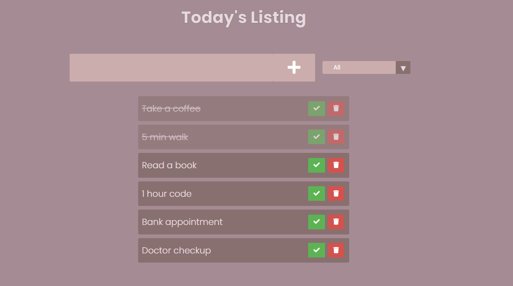

# JavaScript full functiona Todo List, inspired from Dev Ed.

.

### In this project I make a JS Todo List where you can make
- Add todo
- Complete marked and mute Todo
- Delete todo from the list 
- Have local storage functionality. If you have todos in the list and if you close the browser, you can get all of your todos without any loss.

-------------------------

GitHub pages Link: mhasanmeet.github.io/js-todolist/
Cloudfare Pages Link: https://44022a7f.js-todolist.pages.dev/

-------------------------

## If you like the project give me a **Star**